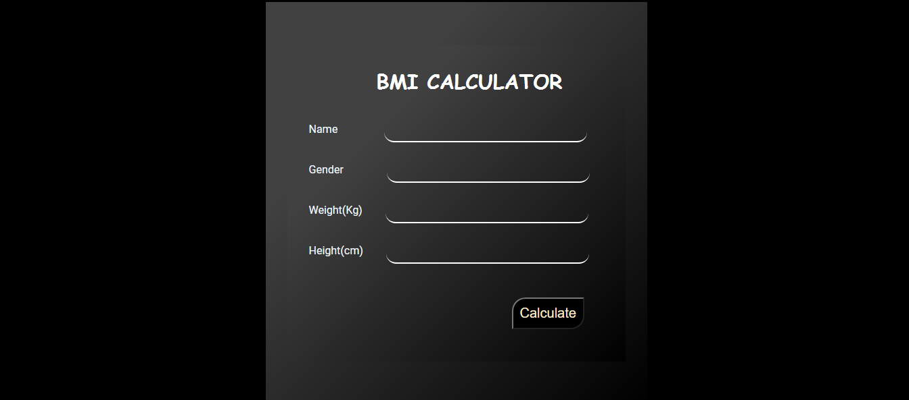
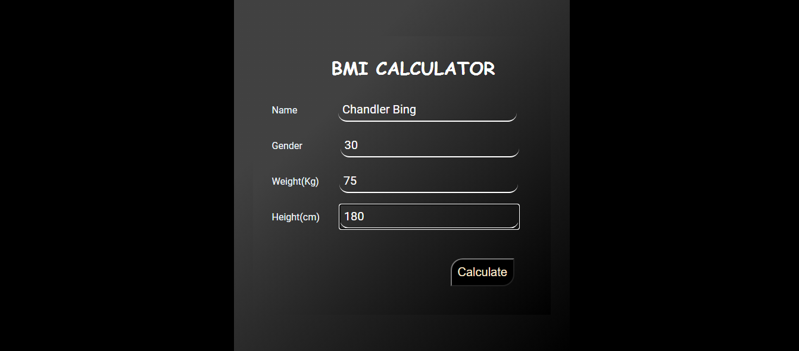
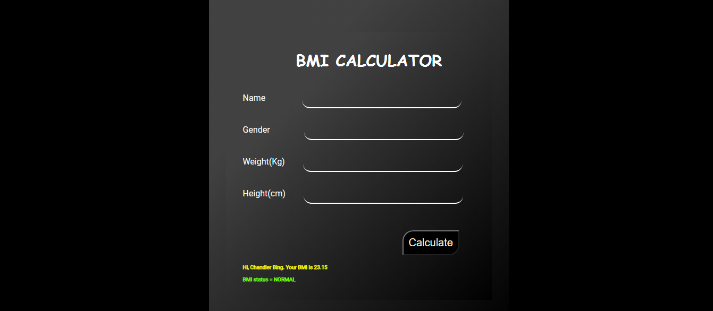

# BMI-Calculator

A basic BMI calculator web application using Flask(Python), HTML and CSS.

This web application was developed to calculate the BMI (Body Mass Index) of a person using his/her height (cm) and weight (kg). This uses Flask for web application framework, HTML and CSS for frontend. The following images will explain about the web application :

 
A web page to enter the details of a person. Name, gender, Weight (in kg) and Height (in cm) is asked.

 
 

 
Sample input has been given :
    
         Name : Chanlder Bing
         Gender : Male
         Weight : 75
         Height : 180

 
 

 
The BMI has been calculated successfully!!!

**Set up :**

Go to command prompt.
In the project directory, you can run:

`'py -3 -m venv venv'`

This command is used to install the virtual environment.

`'venv\Scripts\activate'`

This command is used to activate the environment (in Windows).

`'. venv/bin/activate'`

This command is used to activate the environment (in Mac OS).

`'cd myapp'`

Current directory is myapp now.

`'pip install flask'`

This command installs flask.

**Run :**

To run the code, in command prompt:

`'flask run'`

This runs the flask code. After running you will given be a localhost link (for eg. http://127.0.0.1:5000/). Copy paste in your browser and enter.
If any edit has been done in the code, then:
           1. Save the code.
           2. Go to command prompt and type 'flask run'.
           3. Then go to the localhost website and reload to view the changes.

**Requirements :**

1. Python (Python 3 is recommended)
2. VS code
3. Flask environment set up is required.
